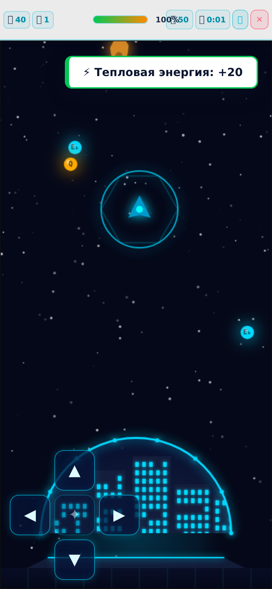

# 🚀 Физика-Квест: Тепловой и электрический щит

Образовательная RPG-игра по физике для 8 класса. Город атакуют метеориты — ученик управляет ракетой с энергетическим щитом и защищает город, отвечая на вопросы по физике. Каждый верный ответ усиливает щит, неверный — оставляет город без защиты.

Игра полностью автономна: **один файл `index.html`** без зависимостей, сборки и интернета. Работает на компьютере, планшете и телефоне.



## ✨ Возможности

- 🎮 **Управление пальцем на телефоне** — ракета летит за пальцем по игровому полю (+ экранные кнопки-стрелки)
- 📚 Уровни по темам курса физики 8 класса: тепловые явления, электричество, магнетизм, оптика и др.
- ❓ Вопросы трёх типов: тест, соответствие, практические задания
- 🌐 Три языка интерфейса: русский, English, Қазақша
- 👤 RPG-профиль: имя пилота, выбор ракеты, опыт, достижения
- 🧑‍🏫 Режим учителя: свои задания и классы с кодом доступа
- 🏆 Рекорды и история игр (сохраняются в браузере)
- 🗺 Мини-карта, пауза, теория с формулами и видеоопытами

## 🎮 Управление

| Устройство | Действие |
|---|---|
| 📱 **Телефон/планшет** | **Ведите пальцем по полю — ракета летит за пальцем.** Отпустили — ракета остановилась. Кнопки-стрелки слева внизу — запасной вариант |
| 💻 Клавиатура | `W A S D` или `↑ ↓ ← →` — движение, `P` — пауза |
| 🖱 Мышь (ПК) | Клик мышью по полю движение не включает — управление только с клавиатуры |

## 🚀 Запуск

**Вариант 1 — просто открыть файл.** Скачайте `index.html` и откройте его в любом браузере (Chrome, Safari, Firefox, Edge). На телефоне файл удобно держать в «Файлах» или добавить на главный экран.

**Вариант 2 — GitHub Pages (свой сайт).** После выгрузки репозитория включите Pages (см. [KAK-VYLOZHIT-NA-GITHUB.md](KAK-VYLOZHIT-NA-GITHUB.md)) — игра будет доступна по адресу:

```
https://ВАШ_НИК.github.io/physics-quest/
```

Откройте этот адрес на телефоне — и играйте, ничего не скачивая.

## 📁 Структура проекта

```
physics-quest/
├── index.html                     ← вся игра (HTML + CSS + JS в одном файле)
├── screenshot.png                 ← скриншот для этого README
├── KAK-VYLOZHIT-NA-GITHUB.md      ← пошаговая инструкция публикации
├── .gitignore
└── uploads/                       ← необязательно: PDF-конспекты для кнопки «Скачать конспект»
```

> 💡 **Про папку `uploads/`:** в игре есть кнопки скачивания PDF-конспектов уроков. Файлы не входят в репозиторий — положите туда свои PDF с именами вида `Fizika_8_klass_konspekt_russkiy.pdf`, `Physics_Grade_8_Notes_English.pdf`, `Fizika_8_synyp_konspekt_kazaksha.pdf` (см. `uploads/README.md`). Без них игра полностью работает — просто кнопки конспектов не будут скачивать файл.

## 🛠 Технические детали

- Чистый JavaScript без фреймворков и сборщиков; Canvas 2D для игрового поля
- Сенсорное управление на Pointer Events с фолбэком на touch-события для старых браузеров
- Прогресс, настройки и рекорды — в `localStorage` браузера
- Все тексты локализованы через встроенный модуль i18n (ru / en / kk)

---

 Сделано в рамках проекта «Физика-Квест» · 2026
